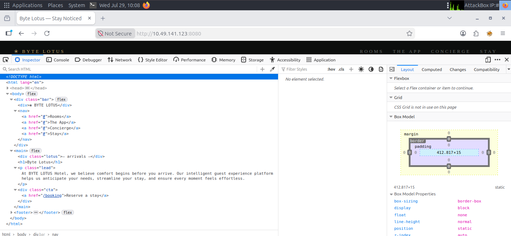
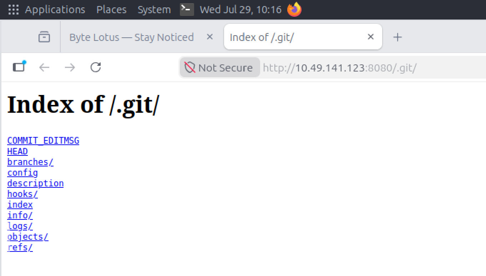
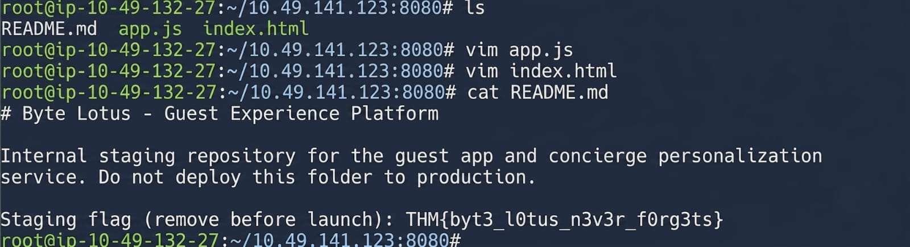

# Day 2: Room 404 - TryHackMe Hacker Holidays Write-up

**Difficulty:** Very Easy
**Category:** Web
**Points:** 30
**Tools Used:** Gobuster, wget, git-dumper

## 📝 Objective
The concierge briefing hints at a room not on the floor plan and an open port 8080. It mentions that a night-shift developer for the Byte Lotus guest-experience platform rushed the deployment and "shipped more than the website." The goal is to enumerate the web server and find what was left behind.

## 🔍 Reconnaissance & Enumeration
*   **Initial Web Check:** I opened the target IP on port 8080 in my browser (`http://<Machine_IP>:8080`). It displayed a general homepage, but checking the source and clicking around revealed nothing useful; all links were just dead placeholders (`#`).



*   **Directory Brute-forcing:** Knowing I needed to find hidden directories, I ran Gobuster against the URL using a standard wordlist (`common.txt`).
    ```bash
    gobuster dir -u http://<Machine_IP>:8080/ -w /usr/share/wordlists/dirb/common.txt
    ```
*   **Findings:** Gobuster quickly found a hit: `/.git/HEAD` and the `/.git/` directory, confirming that the developer accidentally deployed the version control repository to the public web server.

## 🚪 Exploitation / Git Dumping
*   **Manual Inspection:** I navigated to `http://<Machine_IP>:8080/.git/HEAD`. It prompted a file download, but it wasn't immediately readable. I then navigated to `http://<Machine_IP>:8080/.git/` in the browser. It showed an open directory listing containing an `objects/` folder full of hashes instead of standard encoded text.



*   **Downloading the Repository:** Since this was a publicly exposed Git repository, I needed to dump its contents to reconstruct the source code. I initially used `wget` to recursively download the directory:
    ```bash
    wget -r -np -R "index.html" http://<Machine_IP>:8080/.git/
    ```
*   **Using Git-Dumper:** To properly extract and rebuild the repository files, I installed and utilized `git-dumper`.
    ```bash
    pip install git-dumper
    git-dumper http://<Machine_IP>:8080/ repo_dump/
    ```
*   **Finding the Flag:** Navigating into the dumped repository folder, I found three files: `app.js`, `index.html`, and `README.txt`. The first two were standard web files, but reading the `README.txt` file revealed the flag!
    ```bash
    cat README.txt
    ```



## 🚩 Flag
*   **Flag:** `THM{REDACTED}`

## 💡 Key Takeaways
*   **Source Code Exposure:** Deploying `.git` folders to a production web server is a massive security risk. It allows attackers to use tools like `git-dumper` to download the entire source code, commit history, and potentially sensitive information like hardcoded credentials or hidden developer notes.
