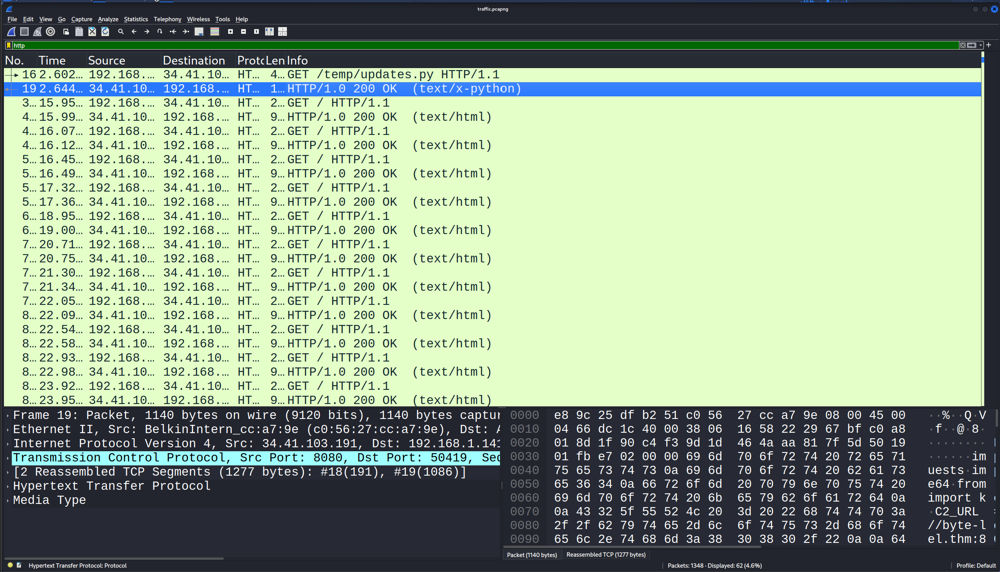
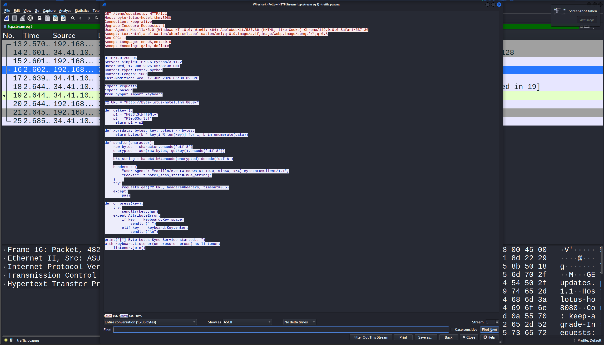
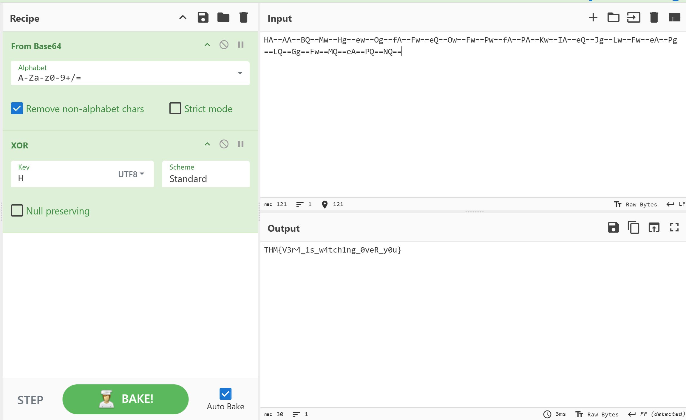

# Day 4: Packed Light - TryHackMe Hacker Holidays Write-up

**Difficulty:** Easy
**Category:** Forensics
**Tools Used:** Wireshark, CyberChef

## 📝 Objective
The room provides a network packet capture (`.pcap`) file and hints at investigating port 8080. The goal is to analyze the network traffic, identify anomalous behavior or exfiltrated data, and decode it to recover the flag.

## 🔍 Reconnaissance & Traffic Analysis
*   **Initial Inspection:** I opened the provided `.pcap` file in Wireshark. Since the hint specifically mentioned port 8080, I applied the `http` filter to narrow down the traffic.
*   **Spotting the Outlier:** Among several standard HTML requests, one specific GET request stood out. It was downloading a Python script (`text/x-python` for `updates.py`), whereas the rest of the traffic seemed to be standard web requests.

## 🚪 Exploitation / Decoding
*   **Analyzing the Malware:** I followed the HTTP/TCP stream for the Python file to inspect its contents. The script revealed a custom keylogger/exfiltration mechanism. It showed that the script was taking input, encoding it with Base64, and encrypting it using XOR with a specific key (`H0t3lSc@ff0ldy...`).

*   **Locating the Payload:** Looking at the script's logic, it was sending the encoded data via a `Cookie` header. I went back to the other HTTP requests in Wireshark and checked their headers. I found the exfiltrated data sequentially chunked inside the `Cookie: hotel_sess_state=` parameter.
*   **Data Extraction & CyberChef:** I copied all the encoded values from those cookie headers sequentially and pasted them into CyberChef.
*   **Cracking the Key:** I set up the CyberChef recipe based on the Python script's logic:
    1.  `From Base64`
    2.  `XOR` (Scheme: Standard, UTF-8)
    *   Initially, I provided the full key found in the Python script, but it did not decode properly. After some trial and error, I realized the script or the XOR logic only required the first letter of the key. 
    *   I changed the XOR key to just `H`, and the flag successfully decrypted!

## 🚩 Flag
*   **Flag:** `THM{REDACTED}`

## 💡 Key Takeaways
*   **Traffic Outliers:** When analyzing a `.pcap`, filtering by protocol (like `http`) and looking for unusual `Content-Type` responses (like a Python script hiding in web traffic) is a great way to find the initial foothold.
*   **Covert Channels:** Malware often exfiltrates data using standard, innocuous-looking HTTP headers like `Cookie` to bypass basic firewall rules and blend in with normal traffic.
*   **Adaptability in Reversing:** Sometimes the logic found in a malicious script might be slightly flawed or require a bit of manual tweaking (like reducing the XOR key to a single character) to properly reverse the payload.
