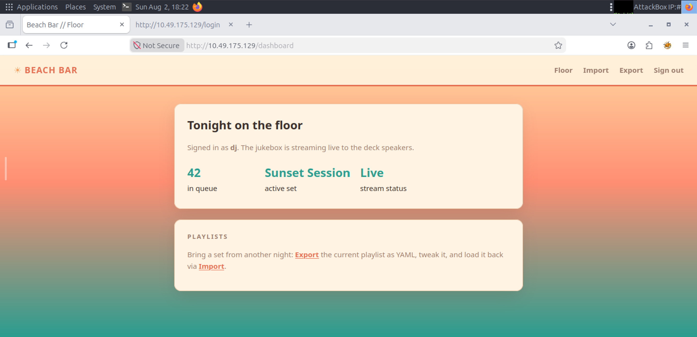

# Day 5: Beach Bar - TryHackMe Hacker Holidays Write-up

<p align="center">
  
  
  
</p>

---

## 📝 Objective

The concierge briefing mentions a beach bar jukebox connected directly to the backend system and a DJ who never logs out. The objective is to gain initial access via the web application, escalate privileges, and completely compromise the server (Boot2Root).

---

## 🔍 Reconnaissance & Enumeration

* **Source Code Inspection:** I started by navigating to the Beach Bar website in my AttackBox. Inspecting the page source code revealed a hidden developer comment mentioning a demo login: `dj/dj`.
* **Initial Access (Web):** I used the credentials `dj` for both the username and password, which successfully logged me into the dashboard.

<p align="center">
  
</p>

* **Application Logic:** Exploring the dashboard, I found that only the "Import" and "Export" features were functional. Clicking "Export" downloaded a YAML (`.yml`) file containing the current playlist structure:
  ```yaml
  playlist:
    name: Season Session
    vibe: golden hour
    tracks:
      - artist: Khruangbin
        title: Maria Tambien
