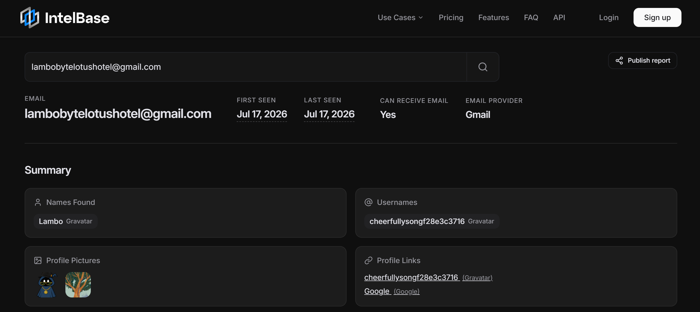
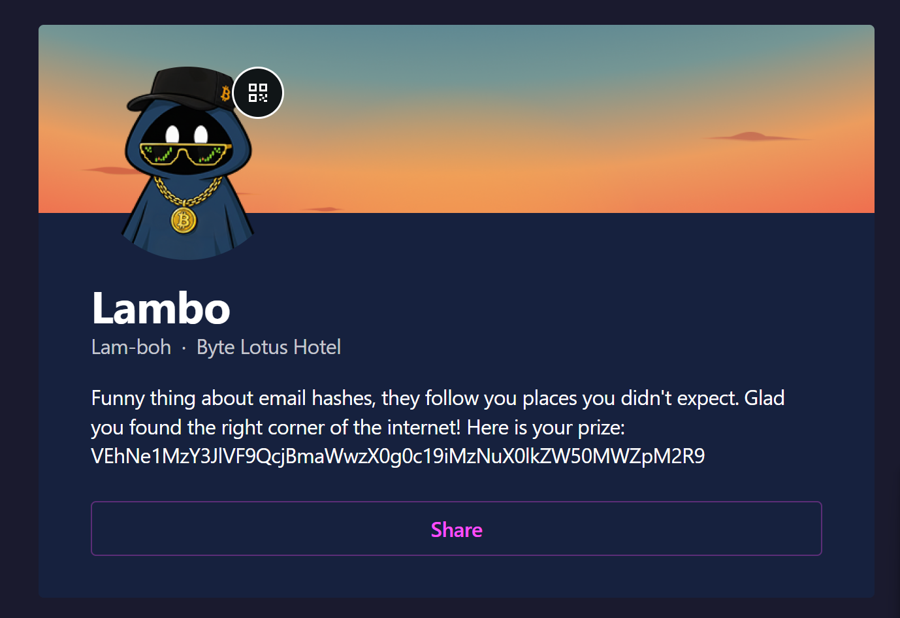
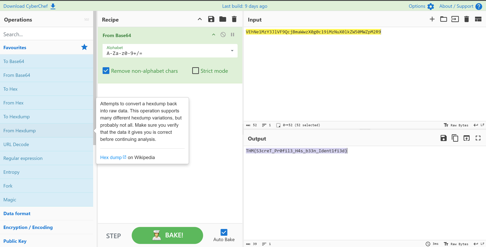

# Day 6: Overheard at Breakfast - TryHackMe Hacker Holidays Write-up

  
  
  

---

## 📝 Objective

The scenario involves a conversation overheard (and screenshotted) at the breakfast terrace. The objective is to analyze the leaked screenshot to find a starting point, perform email OSINT, and track down a hidden profile to uncover the flag.

---

## 🔍 Reconnaissance & Image Analysis

* **Analyzing the Chat:** I started by reviewing the provided screenshot of the conversation between "Ponzi" and "Lambo!". 
* **Extracting Clues:** In the chat, Lambo mentions they don't use social media much anymore but used to use a free tool to link media accounts that "Started with a G". More importantly, Lambo drops their direct contact email: `lambobytelotushotel@gmail.com`.

  

---

## 🕵️‍♂️ OSINT & Tracking

* **Email Enumeration:** Armed with an email address, I navigated to **IntelBase** (an OSINT tool for email footprinting) and searched for `lambobytelotushotel@gmail.com`.
* **Connecting the Dots:** The search results returned active profiles on Google and **Gravatar**. This perfectly matched the "Started with a G" hint from the chat log. The IntelBase report also provided the exact username and a direct link to the Gravatar profile.

  

---

## 🔓 Decoding & Exploitation

* **Profile Inspection:** I opened the Gravatar link provided by IntelBase. On Lambo's profile page, there was a message teasing that email hashes follow you around, along with a "prize": a long, seemingly random string of characters (`VEhNe1MzY3Jl...`).

  

* **Decoding the String:** The string format containing mixed alphanumeric characters and its context as a hidden message strongly suggested Base64 encoding. 
* **Extracting the Flag:** I copied the string, pasted it into **CyberChef**, and applied the `From Base64` recipe. The output cleanly decoded into the final flag.

  

---

## 🚩 Flag

* **Flag:** `THM{REDACTED}`

---

## 💡 Key Takeaways

* **Email Footprinting:** An email address is one of the most powerful pivots in OSINT. Tools like IntelBase can instantly link a seemingly anonymous email to connected services, reviews, and profiles across the web.
* **Gravatar Leaks:** Gravatar (Globally Recognized Avatar) uses MD5 hashes of email addresses to pull profile pictures across different WordPress sites and forums. Because of this, it is a common place to find hidden linkages during an investigation.
