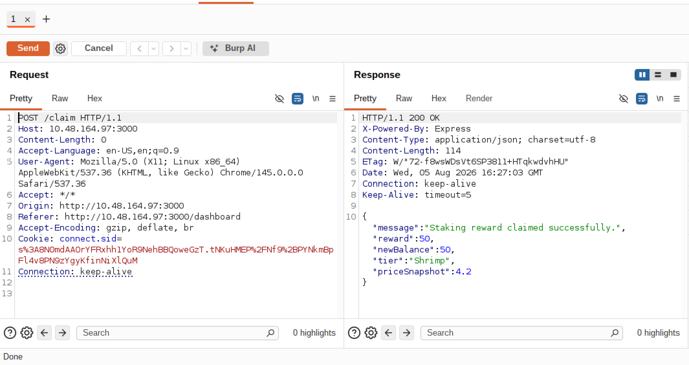
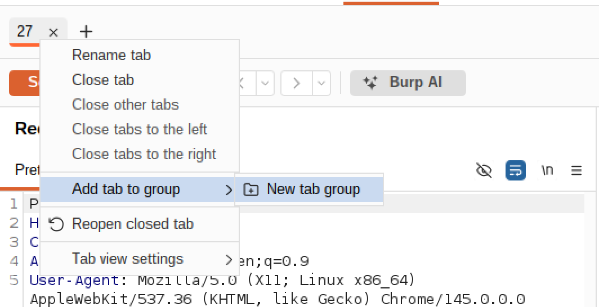
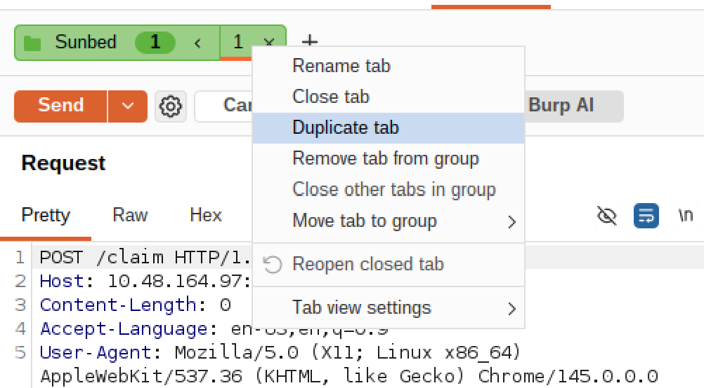
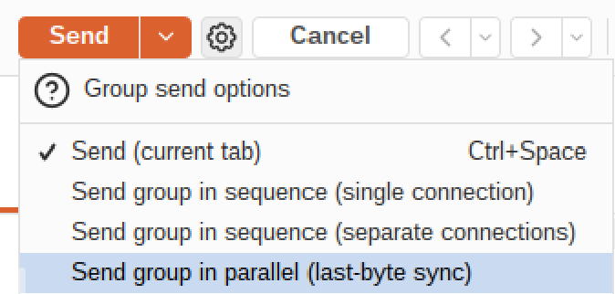
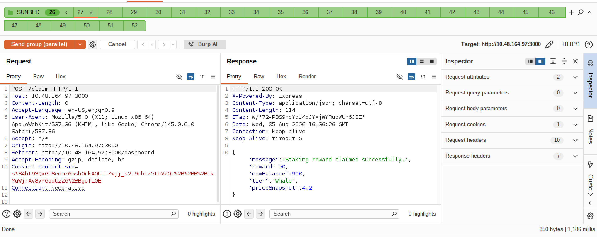
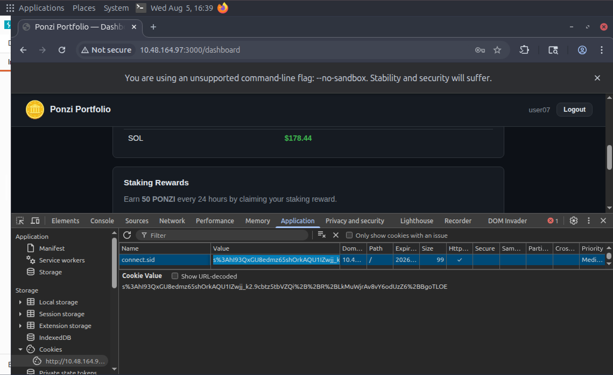
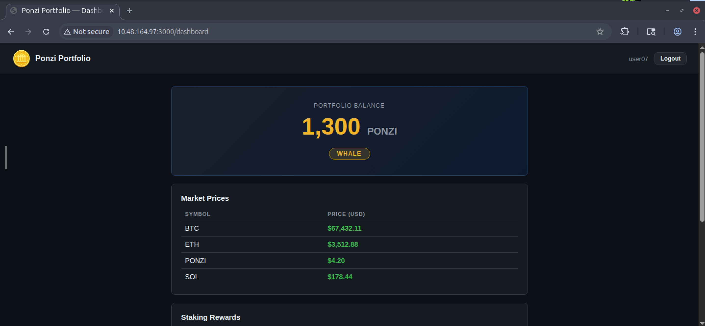
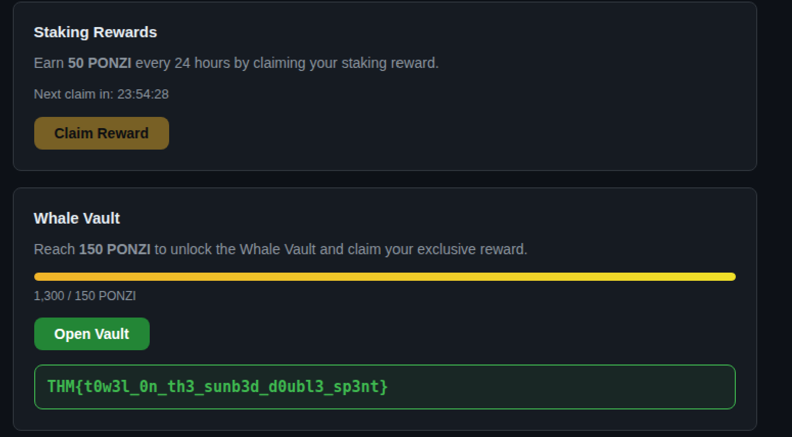

# Day 8: Towel On The Sunbed - TryHackMe Hacker Holidays Write-up

  
  
  

---

## 📝 Objective

The resort's wellness portal runs a crypto rewards application called **Ponzi**. The daily reward mechanism limits claims to once every 24 hours, giving 50 coins per claim. The ultimate goal is to accumulate 150+ coins to unlock the Whale Vault and retrieve the flag by exploiting logic flaws and race conditions in the request cycle.

---

## 🔍 Reconnaissance & Understanding the Flow

* **Account Creation:** I opened the web application and registered a fresh guest account with a username and password.
* **The Claim Mechanic:** Navigating to the dashboard, I found a **Claim** button. Clicking it instantly awarded **50 coins** and triggered a 24-hour cooldown timer. 
* **The Problem:** The flag required a balance of at least 150 coins, but the 24-hour lockout prevented legitimate consecutive claims. This indicated a time-of-check to time-of-use (TOCTOU) vulnerability or a **Race Condition** in how backend credit updates and locks were processed.

---

## 🛠️ Exploitation via Race Condition

Since using the initial account would complicate testing due to the active 24-hour lockout, I created a brand new account via Burp Suite to perform the attack cleanly.

### Step 1: Intercepting the Claim Request
1. Configured Burp Suite as the web proxy and intercepted traffic.
2. Clicked the **Claim** button on the dashboard and captured the incoming claim request.
3. Forwarded the captured request to **Burp Repeater**.

  

### Step 2: Grouping, Duplicating & Parallel Execution
1. Added the claim request to a new **Repeater Group**.
2. Duplicated the request within the group to prepare a batch of parallel actions.
3. Configured the Repeater group execution mode to **Send requests in parallel (single connection)**.
4. Fired the entire batch of requests simultaneously to trigger a race condition on the server.

  
  
  

  

### Step 3: Session Manipulation & Flag Retrieval
1. The server processed the parallel batch before updating the lock state, successfully granting multiple rewards.
2. I copied the updated session cookie from the successful parallel response.
3. Opened the browser's developer tools (**F12 > Application > Cookies**), updated my active session cookie value, and refreshed the page.
4. The dashboard instantly reflected a massive coin balance, opening up the Whale Vault to reveal the flag.

  

  

  

---

## 🚩 Flag

* **Flag:** `THM{REDACTED}`

---

## 💡 Key Takeaways

* **Race Conditions in State Management:** Applications that update user balances or handle daily rewards asynchronously without proper database locks (such as row-level locks or strict transaction isolation) are vulnerable to race conditions.
* **Rate Limiting & Atomicity:** Cooldown timers must be enforced securely on the backend using atomic database operations or transactional checks rather than client-side restrictions or delayed state writes.
