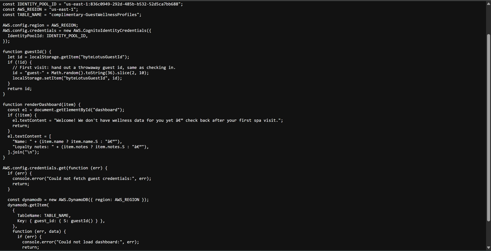
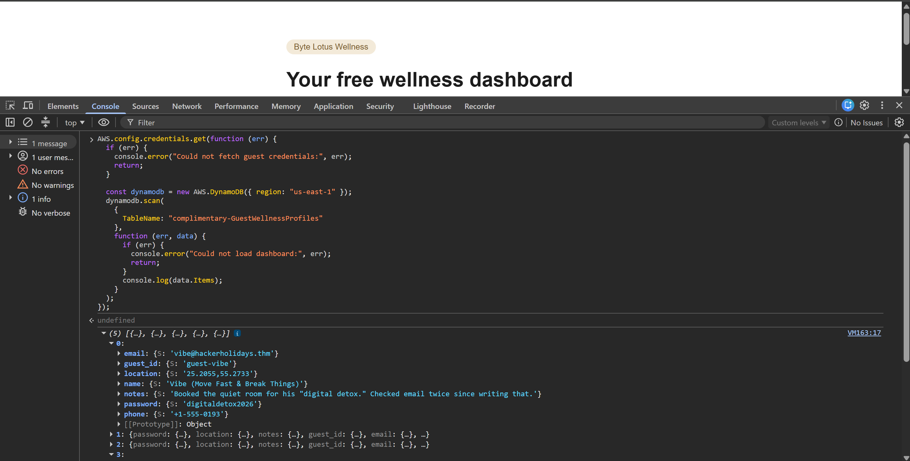

# Day 3: Complimentary - TryHackMe Hacker Holidays Write-up

**Difficulty:** Easy  
**Category:** Web / Cloud Security  
**Tools Used:** Browser Developer Tools (View Source, Console)

---

## 📝 Objective

The Byte Lotus Wellness app promises a "complimentary" and frictionless experience with no sign-up or login required. However, the app still makes authorization decisions behind the scenes. The objective is to investigate the client-side code, discover how the app is making these access decisions, and find hidden credentials to extract sensitive data.

---

## 🔍 Reconnaissance & Enumeration

* **Initial Analysis:** Navigated to the provided website link. Since the app functions without any visible login portal, the authorization logic or API keys had to be handled locally by the browser.
* **Source Code Inspection:** Opened the Browser Developer Tools and inspected the page source.
* **Finding the Leak:** Digging into the loaded assets, I found a file named `app.js`. Upon reviewing its contents, I discovered hardcoded developer code that included sensitive placeholders and their corresponding values, such as an AWS Region and a Database Table Name.

---

## 🚪 Exploitation / Cloud Data Extraction

* **Code Modification:** The `app.js` file didn't just leak the configuration values; it also contained the logic used to fetch data. I copied this JavaScript snippet.
* **Executing the Query:** I modified the copied script, replacing the empty placeholders with the actual hardcoded AWS configuration values I had just found.
* **Retrieving the Flag:** I pasted my modified code directly into the browser's Developer Console and executed it. The script successfully authenticated and printed the restricted data to the console, revealing the flag.

---

## 🚩 Flag

* **Flag:** `THM{REDACTED}`

---

## 💡 Key Takeaways

* **Client-Side Credential Exposure:** Hardcoding cloud configurations, API keys, or database credentials directly into client-side JavaScript (`app.js`) is a critical security vulnerability. Anyone who visits the site can simply read the source code and hijack those credentials to access the backend infrastructure directly.
* **Secure Architecture:** Applications should always route database queries through a secure backend server rather than trusting the client-side application to securely communicate with a cloud database.
